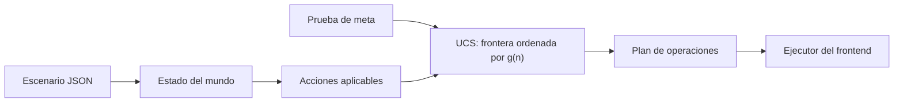
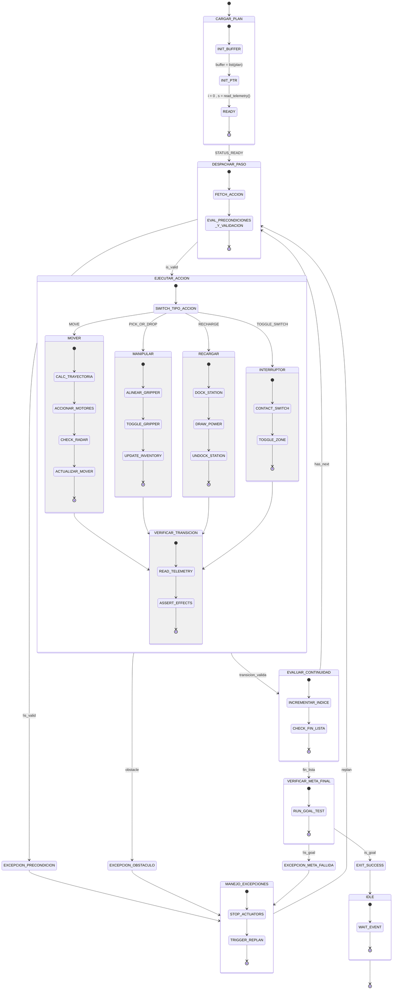

# Diseño del agente inteligente: formulación con búsqueda no informada

## 1. Diseño del agente

### 1.1 Paradigma arquitectónico

El sistema se formula como un **agente resolutor de problemas basado en metas
con búsqueda no informada (ciega)**. El agente no calcula una estimación de distancia a la meta.

La frontera se ordena únicamente por el costo real acumulado $g(n)$. Debido a
que los corredores y las operaciones tienen costos distintos, la estrategia
implementada es **búsqueda de costo uniforme (UCS)**. BFS solo sería equivalente
si todas las acciones tuvieran exactamente el mismo costo; no es el caso de la
instancia oficial.



El solver se encuentra en `project/backend/src/main.py`. El simulador de
`project/backend/src/simulator.py` define la legalidad de las operaciones y
permite reproducir el plan resultante.

### 1.2 Caracterización del entorno

- **Observabilidad:** totalmente observable dentro de la abstracción del
  escenario JSON.
- **Determinismo:** una acción aplicable produce un único sucesor.
- **Dinámica:** el escenario permanece estático durante la planificación.
- **Discretización:** zonas, objetos, estados de puertas/paneles/estaciones,
  batería entera y catálogo discreto de acciones.
- **Agente único:** solo el robot modifica el estado modelado.

## 2. Estado ($\mathcal{S}$)

### 2.1 Definición formal

La representación mínima del estado físico es:

$$s=\langle z,b,payload,floor,doors,panels,stations\rangle\in\mathcal{S}$$

Donde:

- $z$ es la zona actual del robot. En esta implementación pertenece a
  `{Z1, Z2, Z3, Z4, Z5}`; no es una celda individual de la cuadrícula visual.
- $b$ es la batería restante.
- `payload` es la carga del robot.
- `floor` es la distribución de llaves, herramientas y materiales en el suelo.
- `doors` contiene el estado `OPEN` o `CLOSED` de cada puerta.
- `panels` contiene el estado `DAMAGED` u `OK` de cada panel.
- `stations` contiene el estado `OFFLINE` u `ONLINE` de cada estación.

En Python, `simulator.initial_state` materializa estos componentes con las
claves `zone`, `battery`, `payload`, `ground_keys`, `ground_tools`,
`ground_materials`, `doors`, `panels` y `stations`. También conserva
`energy_spent` como contador operativo; este valor no modifica la legalidad
futura y no forma parte de `_state_key`.

### 2.2 Estado inicial ($s_0$)

El estado inicial se obtiene directamente del escenario:

```text
zone      = scenario["robot"]["start"]          = Z1
battery   = scenario["robot"]["battery_start"] = 55
payload   = []
doors     = estados declarados en scenario["doors"]
panels    = estados declarados en scenario["panels"]
stations  = estados declarados en scenario["stations"]
floor     = llaves, herramientas y materiales en sus zonas iniciales
```

La capacidad, la batería máxima, los costos y las dependencias son constantes
derivadas del escenario; no son dimensiones independientes del estado.

### 2.4 Clasificación atómica de objetos muertos

El entorno es monotónico (puertas abiertas, paneles reparados y estaciones activadas no revierten su estado). La arquitectura descompone la verificación de objetos muertos en funciones puras y reutilizables:

- `_is_dead_key`: Una llave está muerta si no existe ninguna puerta cerrada pendiente que la requiera.
- `_is_dead_tool`: Una herramienta está muerta si no existe ningún panel dañado que la necesite.
- `_is_dead_material`: Un material está muerto si no existe ningún panel dañado que lo requiera.

Los objetos muertos en el suelo se excluyen de la clave canónica (`_state_key`), colapsando estados físicamente equivalentes y acelerando la convergencia.

## 3. Acciones ($\mathcal{A}$)

### 3.1 Función de aplicabilidad

Para un estado $s$, `Actions(s)` representa las acciones legalmente posibles:

$$Actions(s)=\{a\in\mathcal{A}\mid Precond(a,s)\}\$$

El simulador conoce el contrato completo. El generador `_successors` puede
usar un conjunto interno más estricto para evitar decisiones irrelevantes,
siempre que no elimine un plan mínimo válido.

### 3.2 Catálogo de operadores

| Operador | Precondiciones | Efectos | Costo |
|---|---|---|---|
| `MOVE(z,z')` | Corredor disponible; puerta abierta si aplica; batería suficiente. | Cambia `zone` a `z'` y descuenta el costo. | Costo del corredor. |
| `PICKUP(r)` | Recurso en la zona actual; peso dentro de capacidad; batería suficiente. | Pasa el recurso del suelo a `payload`. | `action_costs.pickup`. |
| `DROP(r)` | Carga llena, recurso candidato y batería suficiente. | Pasa el recurso de `payload` al suelo actual. | `action_costs.drop`. |
| `OPEN_DOOR(d)` | Zona adyacente, puerta cerrada y llave correcta cargada. | Cambia la puerta a `OPEN`. | `action_costs.interact`. |
| `REPAIR(p)` | Panel dañado en la zona; herramienta y material requeridos cargados. | Panel `OK`; consume el material. | `action_costs.interact`. |
| `ACTIVATE(s)` | Estación offline en la zona; dependencias satisfechas. | Estación `ONLINE`. | `action_costs.interact`. |
| `RECHARGE(c)` | Cargador en la zona; batería menor que la máxima; costo disponible. | Restaura la batería máxima. | `action_costs.recharge`. |

Toda transición exige que la batería sea suficiente antes de pagar el costo.

### 3.3 Política flexible de `DROP` en dos fases

Para evitar la explosión combinatoria sin caer en bloqueos de capacidad (*deadlocks*), `_drop_candidates` opera bajo un esquema *Just-in-Time*:

1. **Filtro de activación:** Solo se evalúa si el robot está a capacidad máxima y hay ítems útiles en el suelo de la zona actual (`_useful_items_in_zone`).
2. **Fase 1 (Objetos muertos):** Si el payload contiene llaves, herramientas o materiales muertos, se devuelven como candidatos prioritarios (poda segura).
3. **Fase 2 (Objetos vivos ordenados por utilidad):** Si todos los ítems son vivos, la heurística `_sort_by_utility` ordena los ítems según la distancia mínima al objetivo o demanda de paneles, permitiendo liberar espacio temporal para no bloquear el plan.

## 4. Modelo de transición ($\mathcal{T}$)

La transición es parcial y determinista:

$$\mathcal{T}:\mathcal{S}\times\mathcal{A}\rightarrow\mathcal{S}$$

$$s'=\mathcal{T}(s,a)$$

solo cuando $a\in Actions(s)$. `_clone_state` copia los contenedores mutables
y aplica los efectos sin modificar el padre:

- `MOVE`: cambia la zona y descuenta batería.
- `PICKUP`: elimina el recurso del suelo y lo agrega a la carga.
- `DROP`: elimina el recurso de la carga y lo coloca en la zona actual.
- `OPEN_DOOR`: marca la puerta como `OPEN`.
- `REPAIR`: marca el panel como `OK` y consume un material.
- `ACTIVATE`: marca la estación como `ONLINE`; no la alterna.
- `RECHARGE`: paga el costo y restaura la batería máxima.

### 4.1 Máquina de estados del agente durante la ejecución

El siguiente diagrama muestra el comportamiento del agente durante la ejecución
del plan. Representa las fases operativas del
robot mientras ejecuta la secuencia de acciones devuelta por el solver.



## 5. Prueba de meta ($\mathcal{G}$)

La meta se define sobre el estado final del mundo, no sobre una lista de tareas:

$$Goal(s)\iff\forall station\in scenario["goal"]["stations\_online"]:\\
  stations[station]=ONLINE$$

En la instancia oficial:

```python
all(
    state["stations"][station_id] == "ONLINE"
    for station_id in scenario["goal"]["stations_online"]
)
```

Las estaciones objetivo son `GENERATOR`, `COMMAND` y `ARTILLERY`. Las puertas
y los paneles son condiciones intermedias, no la meta.

En UCS la prueba se realiza al extraer el nodo mínimo de la frontera, nunca al
generarlo. Así se evita aceptar una solución antes de explorar otra ruta con
menor costo acumulado.

## 6. Función de costo ($\mathcal{C}$)

### 6.1 Costo de paso

Para la instancia oficial todos los costos son positivos:

$$c(s,a,s')\geq\epsilon>0$$

Los costos de las acciones se resuelven dinámicamente con valores por defecto directamente en `_successors`:

- `MOVE`: costo del corredor usado.
- `PICKUP`: `configured_costs.get("pickup", 1)`.
- `DROP`: `configured_costs.get("drop", 1)`.
- `OPEN_DOOR`, `REPAIR`, `ACTIVATE`: `configured_costs.get("interact", 2)`.
- `RECHARGE`: `configured_costs.get("recharge", 3)`.

### 6.2 Costo del camino

Para una ruta $\langle a_1,\ldots,a_k\rangle$:

$$g(n)=\sum_{i=1}^{k}c(s_{i-1},a_i,s_i)$$

La frontera prioriza el menor $g(n)$. Minimizar el número de pasos no es
equivalente a minimizar el costo: una ruta con más operaciones puede ser más
barata si utiliza corredores de menor costo.


## 7. Estrategia de búsqueda, formulación y análisis del espacio

### 7.1 Algoritmo UCS / Dijkstra con dominancia Pareto

El agente utiliza **Búsqueda de Costo Uniforme (UCS)**, la estrategia óptima para espacios de estados con costos heterogéneos y estrictamente positivos ($c(s,a,s') \ge \epsilon > 0$). La evaluación se rige por $f(n) = g(n)$, donde $g(n)$ es el costo acumulado de la ruta.

El control de estados en el grafo no descarta simplemente estados repetidos por clave física, sino que mantiene un conjunto de etiquetas Pareto $(g, b)$ por cada clave canónica (`_state_key`), donde $g$ es el costo acumulado y $b$ es la batería restante.

**Flujo de ejecución del solver:**

1. **Inicialización:** Se inserta el estado inicial $s_0$ en la frontera (min-heap ordenado por $g$) con $g=0$ y camino vacío. Se registra la etiqueta inicial $(0, b_0)$ en la tabla de etiquetas.
2. **Extracción:** Se extrae de la frontera el nodo con menor costo acumulado $g$. Si su par $(g, b)$ ya está dominado por una etiqueta previa más eficiente, el nodo se descarta.
3. **Prueba de meta:** Se verifica si todas las estaciones requeridas en `scenario["goal"]["stations_online"]` están `ONLINE`. Al realizarse al extraer y no al generar, se garantiza la optimalidad del costo.
4. **Expansión y poda:** Para cada acción legal en `_successors`:
* Se calcula el nuevo costo acumulado $g' = g + c(a)$ y el nuevo estado sucesor.
* Se consulta la clave canónica del sucesor en la tabla de etiquetas. Si ya existe una etiqueta previa con menor o igual costo y mayor o igual batería ($g_{prev} \le g'$ y $b_{prev} \ge b'$), la rama se poda inmediatamente por dominancia.
* Si no está dominada, se eliminan las etiquetas que resulten dominadas por la nueva, se almacena $(g', b')$ y se inserta el sucesor en la frontera.

### 7.2 Completitud, optimalidad y alternativas

UCS es completo y óptimo en este dominio bajo las siguientes garantías:

* Costos de transición estrictamente positivos que evitan ciclos infinitos de costo cero.
* Factor de ramificación finito en cada estado.
* Poda de dominancia segura: un estado solo domina a otro si alcanza la misma configuración física con menor o igual costo y mayor o igual batería.
* Comprobación de meta en la extracción de la cola de prioridad.

Alternativas como **BFS** solo serían óptimas si todas las acciones tuvieran costo unitario, lo cual no aplica por la disparidad entre costos de corredores e interacciones. **IDDFS** optimiza memoria en árboles profundos de costo uniforme, pero no garantiza optimalidad con costos heterogéneos.

### 7.3 Formulación y cota del espacio de estados

La cota combinatoria teórica del espacio de estados físicos viene dada por:

$$\vert{}\mathcal{S}\vert{} \le \vert{}Z\vert{} \cdot (B_{max}+1) \cdot \vert{}P\vert{} \cdot \vert{}F\vert{} \cdot 2^{\vert{}D\vert{} + \vert{}P_a\vert{} + \vert{}S_t\vert{}}$$

Donde:

* $\vert{}Z\vert{}$ es el número de zonas (5 en el escenario base).
* $B_{max}+1$ es el rango discreto de batería disponible.
* $\vert{}P\vert{}$ representa las configuraciones válidas de carga dentro de la capacidad del robot.
* $\vert{}F\vert{}$ representa las distribuciones posibles de recursos en el suelo.
* $\vert{}D\vert{}$, $\vert{}P_a\vert{}$ y $\vert{}S_t\vert{}$ son las cantidades de puertas, paneles y estaciones modeladas.

Esta cota sobreestima el espacio real alcanzable, ya que la monotonicidad del entorno (las puertas abiertas no se cierran, los paneles reparados no se dañan), las dependencias lógicas y las restricciones de capacidad reducen drásticamente los estados accesibles.

### 7.4 Complejidad computacional

Siendo $b$ el factor de ramificación promedio, $C^*$ el costo del plan óptimo y $\epsilon$ el costo mínimo de acción, la profundidad efectiva del árbol de búsqueda está acotada por:

$$d_{eff} = \left\lfloor \frac{C^*}{\epsilon} \right\rfloor$$

Lo que sitúa la cota teórica en $O(b^{1+d_{eff}})$. Sin embargo, en la búsqueda sobre grafos la complejidad real depende del número de estados canónicos únicos explorados y de las ramas no dominadas.

### 7.5 Mitigación de explosión combinatoria

Para mantener el tiempo de resolución en el rango de segundos, el sistema aplica cuatro mecanismos de reducción:

1. **Poda *Just-in-Time* de `DROP`:** Se restringe la acción de soltar exclusivamente a momentos donde el robot está a capacidad máxima y existen recursos útiles en la zona actual (`_useful_items_in_zone`), eliminando millones de permutaciones simétricas en zonas de tránsito vacías.
2. **Exclusión de ítems muertos:** Llaves cuyas puertas ya están abiertas, herramientas sin paneles pendientes y materiales agotados se omiten de la clave canónica del suelo (`_state_key`), colapsando estados equivalentes.
3. **Canonicidad de estructuras:** El inventario (`payload`) y los recursos en suelo se serializan como tuplas ordenadas independientes del orden de inserción.
4. **Filtrado Pareto multietiqueta:** Se descartan rutas que llegan a la misma configuración física con mayor costo y menor o igual nivel de batería.