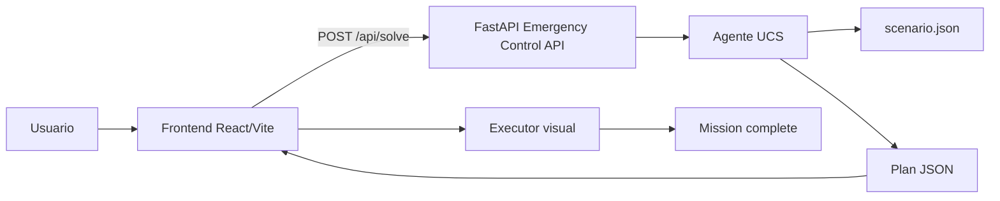
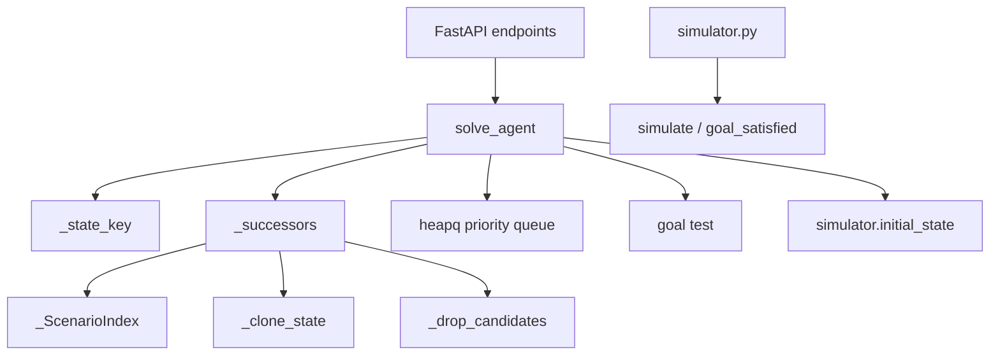

# Diseño y documentación técnica del agente UCS

Este documento combina la formulación académica del agente con la descripción
de la implementación actual. La fuente de verdad del solver es
`project/backend/src/main.py`; `project/backend/src/simulator.py` define el
contrato de legalidad usado para reproducir los planes.

> Las afirmaciones de optimalidad, tiempo y memoria requieren pruebas
> reproducibles. La suite existente valida el plan demo y no constituye por sí
> sola una prueba independiente de optimalidad del solver.

Este documento completa la formulación del problema antes de la implementación principal. El entorno es totalmente observable, determinista, secuencial, estático, discreto y de agente único; por eso la solución correcta es un plan completo y el marco apropiado es la búsqueda clásica en grafos, en particular búsqueda de costo uniforme (UCS), con una representación canónica del estado y una generación de sucesores que no explode el espacio.
El problema no es solo “encontrar una solución” sino hacerlo con una formulación que mantenga la búsqueda completa y óptima sin explotar la memoria ni el tiempo. En este entorno, el cuello de botella no es el mapa, sino la representación del espacio de estados. Si el agente genera acciones irrelevantes, el costo computacional crece de forma combinatoria.

---

## Estado

### Definición formal

La representación mínima que basta para decidir qué puede hacerse después es:

```text
s = ⟨ z, b, payload, floor, doors, panels, stations ⟩
```

donde:

- z: zona actual del robot.
- b: batería restante.
- payload: conjunto canónico de objetos que el robot lleva cargados.
- floor: distribución de objetos en el suelo por zona.
- doors: estado de cada puerta {OPEN, CLOSED}.
- panels: estado de cada panel {DAMAGED, OK}.
- stations: estado de cada estación {OFFLINE, ONLINE}.

Una versión más explícita es:

```text
s = ⟨ zona, batería,
      carga = {objeto: cantidad},
      suelo = {zona -> {objeto: cantidad}},
      puertas = {door_id -> OPEN|CLOSED},
      paneles = {panel_id -> DAMAGED|OK},
      estaciones = {station_id -> OFFLINE|ONLINE} ⟩
```

### Por qué cada variable es necesaria

La regla de clase (“Applicable”) exige que una variable del estado esté presente si y solo si dos configuraciones que difieren en ella pueden diferir en las acciones legales futuras o en sus resultados.

- z: cambia el conjunto de movimientos legales y los objetos/elementos accesibles. Dos estados con distinta zona pueden permitir o prohibir puertas y tareas distintas.
- b: es parte del estado físico. Dos mundos iguales salvo batería tienen diferentes acciones futuras. La batería condiciona si el robot puede mover, abrir, reparar o recargar.
- payload: no es un detalle superficial; decide si el robot puede abrir una puerta, reparar un panel, activar una estación o recoger algo más. Si el robot lleva una clave o una herramienta, eso cambia la legalidad de pasos futuros.
- floor: la posición de los objetos en el suelo es esencial porque el robot puede recogerlos después; además, `DROP` hace que la localización de un objeto ya no se deduzca del escenario inicial.
- doors: una puerta cambia permanentemente el conjunto de movimientos posibles. Es un cambio del entorno que afecta el futuro.
- panels: cada panel en DAMAGED o OK condiciona si aún debe repararse, cuál material y herramienta requieren, y si la estación puede activarse.
- stations: su estado determina si la meta final se está cumpliendo; además, algunas estaciones requieren que otras estén `ONLINE` antes de activarse.

### Qué información se deriva y NO se almacena

No forman parte del estado físico las variables que se pueden deducir del escenario y del propio estado actual. Por ejemplo:

- el grafo de corredores y sus costos;
- la capacidad máxima del robot;
- la batería máxima;
- el costo oficial de cada acción del escenario;
- la lista de dependencias de cada estación;
- la herramienta que requiere cada panel;
- el peso del payload, que puede calcularse a partir del contenido actual;
- las constantes estructurales del mapa.

Si una información puede derivarse del estado actual y de las constantes del escenario, no debería ser una variable independiente.

### Qué pertenece al historial de búsqueda y no al estado físico

En el nodo `n` viven datos del historial, no del mundo físico:

```text
g(n), parent, action
```

- `g(n)` es el costo acumulado del camino.
- `parent` describe el nodo anterior.
- `action` describe la acción que llevó a este estado.

Esos datos no forman parte del estado, porque describen cómo se llegó aquí, no qué situación del mundo hay ahora. Si se metieran en el estado, `CLOSED` ya no podría reconocer que dos caminos distintos llegaron al mismo mundo físico.

### Cuándo dos configuraciones son el mismo estado

Dos configuraciones son equivalentes si representan la misma situación física del mundo, aunque la ruta que las alcanzó difiera.

Por eso:

- los materiales se representan por tipo (`FUSE`, `CHIP`, `CABLE`) y no por ids artificiales;
- `payload` y `floor` se almacenan como multiconjuntos o contadores canónicos;
- no importan el orden de los elementos ni la forma de representarlos en memoria;
- la comparación se hace por valor semántico: misma zona, misma batería, mismo contenido de carga, mismo estado del suelo, mismas puertas, paneles y estaciones.

Esto es crucial para Graph Search: si la representación no es canónica, dos rutas distintas al mismo mundo físico pueden ser tratadas como estados distintos.

### Relevancia: objetos que ya no cambian el futuro

No todos los objetos deben seguir distinguiendo estados. El entorno es monótono: una puerta abierta no vuelve a cerrarse, un panel reparado no debe repararse otra vez, una estación activada no vuelve a OFFLINE.

Por eso ignoro objetos “muertos” si su ubicación ya no afecta ninguna acción futura. Ejemplos:

- una llave cuya puerta ya está abierta;
- un material ya consumido en una reparación;
- una herramienta cuyo panel asociado ya fue reparado y no es necesaria para ninguna estación pendiente.

Si un objeto muerto no habilita ninguna acción futura, incluirlo en el estado multiplica el espacio con permutaciones irrelevantes. Esa abstracción es sound porque no elimina información que pueda cambiar el futuro; solo elimina diferencias que no afectan la legalidad ni el costo mínimo de ninguna solución.

---

## Acciones

Las acciones internas del agente son decisiones de búsqueda; el plan final que emite al frontend se traduce a las cuatro operaciones del contrato: `MOVE`, `PICKUP`, `DROP`, `INTERACT`.

### Acciones internas

| Acción | Precondiciones | Efectos | Costo |
|---|---|---|---|
| `MOVE(z,z')` | corredor entre z y z'; si hay puerta, está OPEN; batería ≥ costo del corredor | robot pasa a z' y gasta costo del corredor | costo oficial del corredor |
| `PICKUP(obj)` | obj en zona actual; no excede capacidad | obj pasa a payload; sale del suelo | `pickup` |
| `DROP(obj)` | obj en payload; es necesario liberar espacio o dejarlo para una etapa posterior | obj pasa al suelo de la zona actual | `drop` |
| `OPEN_DOOR(d)` | robot junto a la puerta; puerta cerrada; llave correcta en payload | puerta OPEN | `interact` |
| `REPAIR(panel)` | robot en la zona del panel; panel DAMAGED; herramienta y material requeridos en payload | panel OK; material consumido | `interact` |
| `ACTIVATE(station)` | robot en la estación; estación OFFLINE; dependencias satisfechas | estación ONLINE | `interact` |
| `RECHARGE(charger)` | robot en un cargador; batería < máxima; batería ≥ costo de recarga | batería vuelve a máxima | `recharge` |

Toda acción del mundo requiere además que `batería ≥ costo` antes de ejecutarse.

### `Applicable` interno vs legalidad del contrato

El simulador dice cuándo un paso es legal. El generador de sucesores decide qué acciones son relevantes para la búsqueda. No son necesariamente el mismo conjunto.

El contrato permite `DROP` en cualquier zona si el objeto está en la carga. Pero si el agente genera `DROP` en todas las situaciones con carga, el espacio pasa a ser “en qué zona quedó cada objeto”, y la búsqueda se vuelve combinatoria.

Por eso el `Applicable` interno será estricto:

- `DROP` solo se genera cuando liberar espacio es necesario para continuar la misión;
- si el objeto ya no es útil para ninguna acción futura, no se genera un `DROP` “por gusto”;
- si el objeto sí es relevante pero la capacidad bloquea una acción crítica, entonces `DROP` pasa a ser una decisión relevante para buscar.

Esto es correcto porque ningún plan de costo mínimo necesita un `DROP` que no libere espacio para un paso necesariamente posterior. Si el objeto no cambia ninguna acción futura, un `DROP` extra no puede mejorar el costo y solo explota el árbol de búsqueda.

---

## Modelo de transición

```text
s --a--> s'    solo si a ∈ Applicable(s)
```

La transición es determinista y parcial. Si una acción es aplicable, se obtiene un estado resultante único:

- `MOVE`: cambia la zona y descuenta el costo del corredor.
- `PICKUP`: mueve el objeto del suelo a la carga.
- `DROP`: mueve el objeto de la carga al suelo.
- `OPEN_DOOR`: cambia `doors[d] = OPEN`.
- `REPAIR`: cambia `panels[p] = OK` y consume el material requerido.
- `ACTIVATE`: cambia `stations[s] = ONLINE`.
- `RECHARGE`: devuelve la batería a su máximo.

Se preserva:

- la topología del escenario;
- las reglas del contrato;
- los costos oficiales;
- las dependencias de estaciones y paneles.

Se puede canonicalizar el estado después de cada transición para garantizar que dos representaciones equivalentes no diferencien en memoria.

---

## Prueba de meta

La meta se verifica sobre el estado final del mundo, no sobre una lista ejecutada de tareas:

```text
Goal(s) ⟺ ∀ station ∈ {GENERATOR, COMMAND, ARTILLERY} : stations[station] = ONLINE
```

Esto refleja la misión real: no basta con “abrir puertas” o “reparar paneles”; la condición decisiva es que las estaciones objetivo estén en ONLINE.

Las puertas y los paneles son medios, no la meta final. Son requisitos que habilitan una secuencia de acciones para llegar a la activación de las estaciones.

---

## Función de costo

La función de costo del nodo es la suma acumulada de los costos reales del escenario:

```text
g(n) = Σ cost(a_i)
```

a lo largo de la ruta desde el estado inicial hasta el nodo actual. El costo de cada acción sigue el contrato:

- `MOVE`: costo del corredor usado;
- `PICKUP`: `action_costs.pickup`;
- `DROP`: `action_costs.drop`;
- `INTERACT` con `OPEN_DOOR`, `REPAIR`, `ACTIVATE`: `action_costs.interact`;
- `INTERACT` con `RECHARGE`: `action_costs.recharge`.

Minimizar pasos no es lo mismo que minimizar costo. Un plan con más pasos puede ser más barato si usa corredores económicos; un plan corto puede ser muy costoso si atraviesa la ruta más cara. Por eso la búsqueda debe minimizar el costo acumulado, no la longitud del plan.

---

## Estrategia de búsqueda

La estrategia apropiada es UCS (Uniform-Cost Search), porque:

- los costos del escenario son heterogéneos;
- el problema exige mínimo costo acumulado;
- el espacio es finito pero ramificado;
- los costos son no negativos.

### Completitud y optimalidad

UCS es completo con costos no negativos y un espacio finito de estados. Es también óptimo para encontrar la ruta de mínimo costo, siempre que la prueba de meta se haga al extraer un nodo de la frontera, no al generarlo.

Esto evita aceptar una solución subóptima antes de explorar una secuencia aún más barata que pudiera aparecer con un costo menor.

### Coste de camino, tiempo y espacio

La frontera prioriza siempre el menor `g(n)`. Eso asegura que el primer estado objetivo extraído es de mínimo costo acumulado.

El costo real del problema depende del factor de ramificación. El gran problema no es el mapa de 5 zonas sino cuántas decisiones de `DROP`/`PICKUP` genera el agente por estado. Si se permite `DROP` sin criterio, el árbol crece de forma combinatoria, y UCS resulta inviable.

### Cuándo fallan las garantías

Las garantías de UCS se rompen si:

- hay costos negativos;
- el estado no es canónico;
- `CLOSED` no guarda el mejor costo real para cada estado físico;
- la frontera se maneja sin criterio de dominancia;
- el agente genera acciones irrelevantes.

### Batería como recurso

La batería debe ir en el estado, pero eso no obliga a explorar todos los paseos que solo gastan energía. Si dos rutas llevan al mismo mundo físico y una tiene más batería residual a menor o igual costo, la otra está dominada.

Por eso `CLOSED` debe guardar para cada estado físico la mejor experiencia encontrada, con criterio de dominancia:

- mismo `zona`, `payload`, `floor`, `doors`, `panels`, `stations`;
- si se alcanza con mayor batería y costo menor o igual, la ruta vieja no puede mejorar ningún plan futuro.

Esto reduce mucho el número de detours inútiles sin perder optimalidad.

---

## Formulación y tamaño del espacio

### 1) ¿Por qué “5 zonas, ~10 objetos, capacidad 3” puede generar millones de nodos?

Porque el estado no es solo “ventana geográfica” sino una combinación de:

- posición del robot;
- objetos cargados;
- objetos en el suelo;
- puertas abiertas;
- paneles reparados;
- estaciones activadas;
- nivel de batería.

Con solo unos pocos objetos, cada uno puede estar en varias ubicaciones y eso hace crecer el espacio de manera combinatoria. El problema no es grande por el mapa; es grande por la formulación.

### 2) ¿Qué papel tiene `DROP` en esa explosión?

`DROP` es el mayor multiplicador de ramificación. Si el agente genera un `DROP` legal para cada objeto cargado en cada estado, entonces cada configuración debe distinguir también “en qué zona quedó cada objeto”. Eso cambia radicalmente el tamaño del espacio.

### 3) ¿Qué podas o abstracciones aplicó y por qué no pierden el óptimo?

Aplico tres reducciones:

1. `DROP` solo cuando es necesario liberar espacio para una acción crítica.
2. Estado canónico por tipo y conteo, no por ids artificiales.
3. Eliminación de objetos muertos y dominancia de la batería.

Ninguna de estas pierde optimalidad porque solo se eliminan diferencias que no pueden afectar la futura legalidad ni el costo mínimo. Conservan exactamente la información relevante para decidir el siguiente paso.

### 4) ¿Por qué no es solución subir la capacidad, bajar las estaciones o ignorar la batería?

- Subir la capacidad: no es una solución general; solo “apaga” esta instancia y falla en otras.
- Bajar las estaciones: cambia la meta real del problema.
- Ignorar la batería: invalida la física del entorno y produce planes imposibles.

La formulación correcta no es forzar un caso concreto; es representar el problema con las reglas reales del escenario para que UCS sea completo y óptimo.

---

## Optimización de la complejidad temporal y espacial para un mejor rendimiento

### 1. Reducción del espacio de estados

La escena tiene cinco zonas, pero la cantidad real de estados no depende solo del mapa. Depende de:

- la posición del robot;
- el conjunto de objetos cargados;
- el suelo por zona;
- las puertas abiertas;
- los paneles reparados;
- las estaciones activadas;
- la batería disponible.

Si se modela cada objeto con libertad total de ubicaciones, el número de estados crece muy rápido. Por eso la representación debe ser canónica y la generación de sucesores debe ser selectiva.

En términos clásicos de búsqueda, el árbol de estados no debe incluir permutaciones que no cambien el futuro. La estrategia es controlar el factor de ramificación, no aumentar la capacidad del robot ni “forzar” la solución con cambios en el escenario.

### 2. Restricción de `DROP`: clave para evitar explosión combinatoria

La acción `DROP` es legal en la mayoría de las situaciones del contrato, pero no todas las instancias legales son relevantes para la búsqueda.

Si el agente genera `DROP` para cada objeto en cada estado con carga, entonces el problema deja de ser “¿cuál es el mejor plan para restaurar el sistema?” y pasa a ser “¿en qué zona exacta quedó cada objeto?”. Eso replica el mismo mundo físico en múltiples permutaciones irrelevantes.

Por ello, se define `DROP` como una acción relevante solo cuando:

- el robot necesita liberar capacidad para recoger un objeto crítico para una puerta o reparación;
- el objeto ya no tiene utilidad para el futuro y su ubicación en el suelo no influye en la solución;
- el soltarlo permite avanzar sin degradar el costo óptimo.

Esta restricción es sound porque no elimina ninguna acción que pueda formar parte de un plan mínimo. Si un `DROP` no libera un recurso necesario o no cambia la capacidad para una tarea futura, entonces no puede mejorar la calidad de la solución ni afectar la validez del plan.

### 3. Estado canónico y equivalencia física

Para que UCS funcione correctamente, el algoritmo debe reconocer estados equivalentes como la misma situación física.

Por eso:

- materiales equivalentes se representan por tipo, no por identificadores artificiales;
- `payload` y `floor` se almacenan como estructuras canónicas;
- el orden de objetos no importa;
- el estado es comparable por valor, no por referencia.

Esto permite que `CLOSED` detecte estados ya visitados y evite reexplorar la misma configuración del mundo. Si la misma situación física puede aparecer con diferentes representaciones, la búsqueda pierde garantías de optimalidad y memoria.

### 4. Dominancia de batería y poda de estados no útiles

La batería forma parte del estado, porque cambia qué acciones son posibles. Sin embargo, no debe tratarse como un mundo separado a cada consumo.

La observación clave es:

> Si dos caminos llegan al mismo mundo físico y uno tiene más batería residual con costo menor o igual, el otro está dominado.

Entonces, en `CLOSED`, se guarda el mejor costo para un estado físico y se descarta una ruta que llega con peor batería y costo no menor.

Esto reduce drásticamente los “detours inútiles” que solo consumen energía. Es una forma de poda segura porque no afecta la optimalidad: si un camino domina a otro, cualquier continuación del camino dominado puede ser sustituida por la continuación del camino dominante sin empeorar la solución.

### 5. Relevancia de objetos muertos

No todo objeto debe seguir distinguiendo estados. Si una llave ya abrió su puerta, o un material ya fue consumido, o una herramienta ya no tiene uso para ningún panel que siga pendiente, entonces su ubicación en el suelo no afecta ninguna acción razonable del futuro.

Ese tipo de objetos se consideran “muertos” para la búsqueda. Se les puede ignorar sin perder optimalidad porque su presencia no cambia el conjunto de acciones legales futuras ni el costo mínimo posible.

Este principio es esencial para evitar un espacio combinatorio donde cada objeto muerto sigue introduciendo permutaciones irrelevantes.

### 6. Complejidad esperada y diseño de la búsqueda

Con estas decisiones:

- la ramificación del árbol se mantiene controlada;
- `CLOSED` evita revisitar estados equivalentes;
- la batería no se convierte en un factor de explosión artificial;
- `DROP` no se genera sin motivo;
- objetos muertos no se conservan como dimensiones del estado.

En términos de complejidad, el costo real del algoritmo ya no depende solo del tamaño del mapa, sino del número de estados relevantes que realmente cambian el futuro. La estrategia correcta es hacer la formulación lo más compacta posible sin perder información útil.

### 7. Conclusión

La clave para mejorar el rendimiento no es “subir la capacidad”, “ignorar la batería” o “agregar más memoria”. La mejora real viene de una formulación correcta del problema:

- representar solo información relevante;
- usar estados canónicos;
- generar solo acciones relevantes;
- aplicar dominancia de batería;
- eliminar objetos muertos;
- mantener `CLOSED` sobre equivalencias físicas.

Esto permite que UCS siga siendo completo y óptimo, pero sin perder tiempo en un espacio de estados inflado artificialmente.

---

## Arquitectura del componente

### Contexto del sistema — C4 nivel contexto



### Componentes y dependencias



| Componente | Ubicación | Responsabilidad |
|---|---|---|
| API | `backend/src/main.py` | Expone `/api/health`, `/api/scenario` y `/api/solve`. |
| Solver | `backend/src/main.py` | Ejecuta UCS, genera sucesores y aplica dominancia. |
| Índice | `_ScenarioIndex` | Agrupa datos estáticos del escenario para evitar búsquedas repetidas. |
| Simulador | `backend/src/simulator.py` | Aplica pasos, valida precondiciones y comprueba la meta. |
| Frontend | `frontend/src/lib/api.ts`, `executor.ts` | Solicita y ejecuta el plan. |

El código usa composición de funciones y diccionarios de estado; no existe una
jerarquía de clases para las acciones. `_ScenarioIndex` es una estructura
inmutable por contrato (`dataclass(frozen=True)`), aunque sus diccionarios
internos siguen siendo referencias mutables. `_clone_state` realiza copias
controladas para que cada sucesor pueda modificarse sin alterar el estado padre;
esta propiedad debe mantenerse cubierta por pruebas.

## Calidad, rendimiento y limitaciones verificables

### Rendimiento

`_ScenarioIndex` evita parte de las búsquedas lineales y `_clone_state` evita
un `deepcopy` completo. Sin embargo, cada sucesor sigue copiando varios
diccionarios y cada nodo conserva el plan completo (`path + [action]`), por lo
que tiempo y memoria pueden crecer con la cantidad de etiquetas Pareto.

La respuesta pública actual no expone expansiones, tamaño máximo de frontera,
cantidad de etiquetas ni memoria. Por ello no deben documentarse cifras de
rendimiento sin una medición externa reproducible.

### Corrección y confiabilidad

- `simulator.py` rechaza batería insuficiente, puertas cerradas, carga excedida,
    dependencias incumplidas y operaciones fuera de zona.
- Un plan del solver debe reproducirse con `simulate` y satisfacer
    `goal_satisfied` antes de considerarse válido.
- La prueba existente en `backend/tests/test_demo_plan.py` valida el plan
    artesanal, no directamente `solve_agent`.
- Agotar 50.000 expansiones no demuestra que no exista solución; significa que
    el presupuesto configurado fue insuficiente.

### Seguridad y operación

La API usa CORS abierto y no tiene autenticación. Esto es apropiado para la
demo local, pero no para producción. Un despliegue real debería validar el
esquema del escenario, limitar tamaños y rechazar costos negativos.

### Deuda documentada

1. El archivo contiene dos implementaciones de búsqueda; debe conservarse una
     sola ruta activa.
2. `_drop_candidates` documenta conservar alternativas relevantes de capacidad,
     pero la implementación actual retorna candidatos muertos; esta diferencia
     requiere una prueba antes de cualquier corrección.
3. Los diagnósticos estáticos reportan complejidad elevada en el generador de
     sucesores y en el simulador.
4. La optimalidad del costo debe compararse con una referencia independiente de
     UCS; el plan demo no es un oráculo de optimalidad.
