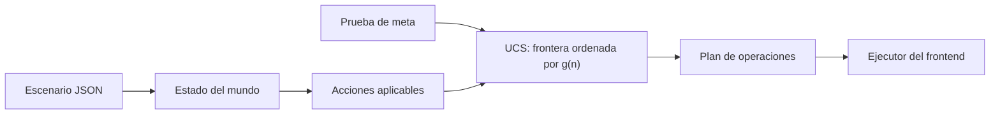

# Diseño del agente inteligente: formulación con búsqueda no informada

## 1. Diseño del agente

### 1.1 Paradigma arquitectónico

El sistema se formula como un **agente resolutor de problemas basado en metas
con búsqueda no informada (ciega)**. El agente no calcula una estimación de distancia a la meta.

La frontera se ordena únicamente por el costo real acumulado $g(n)$. Debido a
que los corredores y las operaciones tienen costos distintos, la estrategia
implementada es **búsqueda de costo uniforme (UCS)**. BFS solo sería equivalente
si todas las acciones tuvieran exactamente el mismo costo; no es el caso de la
instancia oficial.



El solver se encuentra en `project/backend/src/main.py`. El simulador de
`project/backend/src/simulator.py` define la legalidad de las operaciones y
permite reproducir el plan resultante.

### 1.2 Caracterización del entorno

- **Observabilidad:** totalmente observable dentro de la abstracción del
  escenario JSON.
- **Determinismo:** una acción aplicable produce un único sucesor.
- **Dinámica:** el escenario permanece estático durante la planificación.
- **Discretización:** zonas, objetos, estados de puertas/paneles/estaciones,
  batería entera y catálogo discreto de acciones.
- **Agente único:** solo el robot modifica el estado modelado.

## 2. Estado ($\mathcal{S}$)

### 2.1 Definición formal

La representación mínima del estado físico es:

$$s=\langle z,b,payload,floor,doors,panels,stations\rangle\in\mathcal{S}$$

Donde:

- $z$ es la zona actual del robot. En esta implementación pertenece a
  `{Z1, Z2, Z3, Z4, Z5}`; no es una celda individual de la cuadrícula visual.
- $b$ es la batería restante.
- `payload` es la carga del robot.
- `floor` es la distribución de llaves, herramientas y materiales en el suelo.
- `doors` contiene el estado `OPEN` o `CLOSED` de cada puerta.
- `panels` contiene el estado `DAMAGED` u `OK` de cada panel.
- `stations` contiene el estado `OFFLINE` u `ONLINE` de cada estación.

En Python, `simulator.initial_state` materializa estos componentes con las
claves `zone`, `battery`, `payload`, `ground_keys`, `ground_tools`,
`ground_materials`, `doors`, `panels` y `stations`. También conserva
`energy_spent` como contador operativo; este valor no modifica la legalidad
futura y no forma parte de `_state_key`.

### 2.2 Estado inicial ($s_0$)

El estado inicial se obtiene directamente del escenario:

```text
zone      = scenario["robot"]["start"]          = Z1
battery   = scenario["robot"]["battery_start"] = 55
payload   = []
doors     = estados declarados en scenario["doors"]
panels    = estados declarados en scenario["panels"]
stations  = estados declarados en scenario["stations"]
floor     = llaves, herramientas y materiales en sus zonas iniciales
```

La capacidad, la batería máxima, los costos y las dependencias son constantes
derivadas del escenario; no son dimensiones independientes del estado.

### 2.3 Información derivada y equivalencia

No se almacenan como parte del estado físico el grafo de corredores, los costos,
la capacidad, la batería máxima, los requisitos de herramientas/materiales ni
las dependencias de estaciones, porque se derivan del escenario.

`_state_key(state, index)` construye una tupla canónica con zona, carga, suelo,
puertas, paneles y estaciones. Ordena las estructuras para que el resultado no
dependa del orden de inserción. Los materiales se identifican por tipo y
cantidad, no por identificadores artificiales.

La batería no está dentro de `_state_key`. Para compensarlo, `solve_agent`
conserva varias etiquetas Pareto `(costo, batería)` por clave física. Una
etiqueta se domina si otra llega al mismo mundo con costo menor o igual y
batería mayor o igual.

Los datos de historial no son estado físico:

```text
g(n), parent, action
```

`g(n)` es el costo acumulado; `parent` y `action` describen cómo se llegó al
nodo. El solver actual almacena el camino completo en cada entrada de frontera;
conceptualmente puede reconstruirse mediante padres sin incluirlos en la clave.

### 2.4 Objetos muertos

El escenario es monotónico: las puertas abiertas no se cierran, los paneles
reparados no vuelven a dañarse y las estaciones activadas no vuelven a estar
offline. `_is_dead_item` permite ignorar en la clave del suelo objetos que ya no
pueden habilitar acciones futuras, como una llave cuya puerta está abierta o una
herramienta cuyo panel asociado ya está reparado.

Esta reducción solo es segura si el objeto no puede cambiar ninguna acción
futura. Debe conservarse esa condición al extender el escenario.

## 3. Acciones ($\mathcal{A}$)

### 3.1 Función de aplicabilidad

Para un estado $s$, `Actions(s)` representa las acciones legalmente posibles:

$$Actions(s)=\{a\in\mathcal{A}\mid Precond(a,s)\}\$$

El simulador conoce el contrato completo. El generador `_successors` puede
usar un conjunto interno más estricto para evitar decisiones irrelevantes,
siempre que no elimine un plan mínimo válido.

### 3.2 Catálogo de operadores

| Operador | Precondiciones | Efectos | Costo |
|---|---|---|---|
| `MOVE(z,z')` | Corredor disponible; puerta abierta si aplica; batería suficiente. | Cambia `zone` a `z'` y descuenta el costo. | Costo del corredor. |
| `PICKUP(r)` | Recurso en la zona actual; peso dentro de capacidad; batería suficiente. | Pasa el recurso del suelo a `payload`. | `action_costs.pickup`. |
| `DROP(r)` | Carga llena, recurso candidato y batería suficiente. | Pasa el recurso de `payload` al suelo actual. | `action_costs.drop`. |
| `OPEN_DOOR(d)` | Zona adyacente, puerta cerrada y llave correcta cargada. | Cambia la puerta a `OPEN`. | `action_costs.interact`. |
| `REPAIR(p)` | Panel dañado en la zona; herramienta y material requeridos cargados. | Panel `OK`; consume el material. | `action_costs.interact`. |
| `ACTIVATE(s)` | Estación offline en la zona; dependencias satisfechas. | Estación `ONLINE`. | `action_costs.interact`. |
| `RECHARGE(c)` | Cargador en la zona; batería menor que la máxima; costo disponible. | Restaura la batería máxima. | `action_costs.recharge`. |

Toda transición exige que la batería sea suficiente antes de pagar el costo.

### 3.3 Restricción de `DROP`

El contrato permite soltar un objeto cargado, pero generar `DROP` en cualquier
estado multiplicaría las configuraciones del suelo. La política interna solo
considera `DROP` cuando el robot está lleno, existe un recurso útil en la zona
y el candidato es un objeto muerto según la política actual.

Esta poda reduce el factor de ramificación, pero debe validarse con casos donde
la capacidad obligue a liberar un objeto todavía relevante. La legalidad del
simulador y la completitud del generador no son exactamente el mismo concepto.

## 4. Modelo de transición ($\mathcal{T}$)

La transición es parcial y determinista:

$$\mathcal{T}:\mathcal{S}\times\mathcal{A}\rightarrow\mathcal{S}$$

$$s'=\mathcal{T}(s,a)$$

solo cuando $a\in Actions(s)$. `_clone_state` copia los contenedores mutables
y aplica los efectos sin modificar el padre:

- `MOVE`: cambia la zona y descuenta batería.
- `PICKUP`: elimina el recurso del suelo y lo agrega a la carga.
- `DROP`: elimina el recurso de la carga y lo coloca en la zona actual.
- `OPEN_DOOR`: marca la puerta como `OPEN`.
- `REPAIR`: marca el panel como `OK` y consume un material.
- `ACTIVATE`: marca la estación como `ONLINE`; no la alterna.
- `RECHARGE`: paga el costo y restaura la batería máxima.

### 4.1 Máquina de estados del agente durante la ejecución

El siguiente diagrama muestra el comportamiento del agente durante la ejecución
del plan. Representa las fases operativas del
robot mientras ejecuta la secuencia de acciones devuelta por el solver.

```mermaid
---
config:
  layout: elk
---
stateDiagram-v2
    [*] --> 📥_CargandoPlan : Recibe la lista de pasos del planificador

    state 📥_CargandoPlan {
        [*] --> 📝_GuardarPasos : Guardar instrucciones en memoria
        📝_GuardarPasos --> 🔢_IniciarContador : Empezar en el paso 1
        🔢_IniciarContador --> [*] : Robot listo para actuar
    }

    📥_CargandoPlan --> 🔍_RevisandoPaso : Iniciar recorrido

    state 🔍_RevisandoPaso {
        [*] --> 📖_LeerPasoActual : Identificar qué acción toca hacer
        📖_LeerPasoActual --> 🛡️_VerificarEntorno : Confirmar que el camino y el robot están listos
        🛡️_VerificarEntorno --> [*]
    }

    🔍_RevisandoPaso --> ⚙️_RealizandoAccion : [Todo listo para avanzar]
    🔍_RevisandoPaso --> ⚠️_DetectarFalloPrevio : [El entorno no coincide con lo esperado]

    state ⚙️_RealizandoAccion {
        [*] --> 🔀_IdentificarTipoTarea : ¿Qué tarea corresponde?

        🔀_IdentificarTipoTarea --> 🚜_Desplazamiento : Tarea de Movimiento
        🔀_IdentificarTipoTarea --> 🦾_ManejoMaterial : Tarea de Recoger o Entregar
        🔀_IdentificarTipoTarea --> 🔋_CargaEnergia : Tarea de Recarga
        🔀_IdentificarTipoTarea --> 🔘_UsoInterruptor : Tarea de Accionar Puerta/Botón

        state 🚜_Desplazamiento {
            [*] --> 🗺️_TrazarRutaLocal : Calcular camino corto
            🗺️_TrazarRutaLocal --> 🏎️_MoverRuedas : Activar motores
            🏎️_MoverRuedas --> 📡_SensorAnticolision : Sensores vigilando el frente
            📡_SensorAnticolision --> 🏁_LlegadaACelda : Posición alcanzada
            LlegadaACelda --> [*]
        }

        state 🦾_ManejoMaterial {
            [*] --> 🎯_AlinearBrazo : Orientar la pinza hacia el objeto
            🎯_AlinearBrazo --> 🤏_AccionarGarra : Agarrar o soltar el objeto
            AccionarGarra --> 📦_ConfirmarCarga : Comprobar peso/sensor
            📦_ConfirmarCarga --> [*]
        }

        state 🔋_CargaEnergia {
            [*] --> 🔌_ConectarEstacion : Acoplarse al enchufe de carga
            🔌_ConectarEstacion --> ⚡_LlenarBateria : Recibir electricidad
            ⚡_LlenarBateria --> 🔓_DesconectarEstacion : Batería al 100%
            🔓_DesconectarEstacion --> [*]
        }

        state 🔘_UsoInterruptor {
            [*] --> 👆_PresionarBoton : Tocar interruptor
            👆_PresionarBoton --> 🚪_ConfirmarCambio : Verificar apertura de paso
            🚪_ConfirmarCambio --> [*]
        }

        🚜_Desplazamiento --> 📊_ValidarResultadoPaso : Movimiento finalizado
        🦾_ManejoMaterial --> 📊_ValidarResultadoPaso : Objeto manipulado
        🔋_CargaEnergia --> 📊_ValidarResultadoPaso : Batería recargada
        🔘_UsoInterruptor --> 📊_ValidarResultadoPaso : Interruptor accionado

        state 📊_ValidarResultadoPaso {
            [*] --> 👁️_SensorConfirmacion : Revisar con sensores que todo salió bien
            👁️_SensorConfirmacion --> [*]
        }
    }

    ⚙️_RealizandoAccion --> 🔄_EvaluandoSiguienteAccion : [Paso completado con éxito]
    ⚙️_RealizandoAccion --> 🚫_BloqueoEnCamino : [Obstáculo inesperado en el camino]

    state 🔄_EvaluandoSiguienteAccion {
        [*] --> ➕_AvanzarContador : Sumar 1 al paso actual
        ➕_AvanzarContador --> ❓_QuedanMasPasos : ¿Faltan acciones por hacer?
        ❓_QuedanMasPasos --> [*]
    }

    🔄_EvaluandoSiguienteAccion --> 🔍_RevisandoPaso : [Sí: pasar al siguiente paso]
    🔄_EvaluandoSiguienteAccion --> 🏁_RevisionMetaFinal : [No: se ejecutaron todos los pasos]

    state 🏁_RevisionMetaFinal {
        [*] --> 🎯_ComprobarObjetivoCumplido : ¿Se logró la meta completa?
        🎯_ComprobarObjetivoCumplido --> [*]
    }

    🏁_RevisionMetaFinal --> 🏆_MisionCompletada : [Objetivo alcanzado con éxito]
    🏁_RevisionMetaFinal --> ❌_MetaIncompleta : [Falta algún requisito para la meta]

    state 🛑_ManejoDeImprevistos {
        ⚠️_DetectarFalloPrevio --> 🛑_FrenarRobot : Detener motores de forma segura
        🚫_BloqueoEnCamino --> 🛑_FrenarRobot : Freno inmediato por obstáculo
        ❌_MetaIncompleta --> 🛑_FrenarRobot : Detener por resultado incompleto
        🛑_FrenarRobot --> 📡_EnviarAlertaYEstado : Informar al planificador qué pasó
        📡_EnviarAlertaYEstado --> [*]
    }

    🛑_ManejoDeImprevistos --> [*] : El planificador crea un nuevo plan adaptado

    🏆_MisionCompletada --> ⏳_EnReposo : Avisar al usuario y descansar
    ⏳_EnReposo --> [*] : En espera de una nueva misión
```



## 5. Prueba de meta ($\mathcal{G}$)

La meta se define sobre el estado final del mundo, no sobre una lista de tareas:

$$Goal(s)\iff\forall station\in scenario["goal"]["stations\_online"]:\\
  stations[station]=ONLINE$$

En la instancia oficial:

```python
all(
    state["stations"][station_id] == "ONLINE"
    for station_id in scenario["goal"]["stations_online"]
)
```

Las estaciones objetivo son `GENERATOR`, `COMMAND` y `ARTILLERY`. Las puertas
y los paneles son condiciones intermedias, no la meta.

En UCS la prueba se realiza al extraer el nodo mínimo de la frontera, nunca al
generarlo. Así se evita aceptar una solución antes de explorar otra ruta con
menor costo acumulado.

## 6. Función de costo ($\mathcal{C}$)

### 6.1 Costo de paso

Para la instancia oficial todos los costos son positivos:

$$c(s,a,s')\geq\epsilon>0$$

Los costos concretos son:

- `MOVE`: costo del corredor usado.
- `PICKUP`: `action_costs.pickup`.
- `DROP`: `action_costs.drop`.
- `OPEN_DOOR`, `REPAIR`, `ACTIVATE`: `action_costs.interact`.
- `RECHARGE`: `action_costs.recharge`.

No se usa distancia geométrica ni factor de terreno para el costo del solver;
se usa el costo explícito de `scenario["corridors"]`.

### 6.2 Costo del camino

Para una ruta $\langle a_1,\ldots,a_k\rangle$:

$$g(n)=\sum_{i=1}^{k}c(s_{i-1},a_i,s_i)$$

La frontera prioriza el menor $g(n)$. Minimizar el número de pasos no es
equivalente a minimizar el costo: una ruta con más operaciones puede ser más
barata si utiliza corredores de menor costo.

## 7. Estrategia de búsqueda no informada

### 7.1 UCS / Dijkstra

UCS es la estrategia adecuada para costos variables y no negativos:

- evaluación: $f(n)=g(n)$;
- frontera: `heapq` como min-heap por costo acumulado;
- control de grafos: clave canónica y etiquetas Pareto;
- meta: comprobada al extraer.

```text
UCS(s0, GoalTest):
    frontera <- min-heap con (g=0, s0, camino vacío)
    labels[s0_key] <- (0, batería inicial)

    mientras frontera no esté vacía:
        nodo <- extraer el menor g

        si (g, batería) está dominado en labels:
            continuar
        si GoalTest(nodo.estado):
            retornar nodo.camino

        para cada (sucesor, acción) en _successors(nodo.estado):
            nuevo_g <- nodo.g + costo(acción)
            clave <- _state_key(sucesor)

            si existe una etiqueta con costo <= nuevo_g
               y batería >= batería(sucesor):
                continuar

            eliminar etiquetas dominadas
            insertar (nuevo_g, sucesor) en la frontera

    retornar fallo
```

La implementación usa entradas perezosas: pueden quedar entradas obsoletas en
el heap, pero `labels` impide expandir etiquetas dominadas. También existe un
límite operativo de 50.000 expansiones; superarlo significa presupuesto
agotado, no imposibilidad matemática.

### 7.2 Completitud y optimalidad

UCS es completo y óptimo bajo estas premisas:

1. costos no negativos;
2. factor de ramificación finito;
3. estado canónico;
4. generación completa de sucesores del modelo elegido;
5. poda de dominancia segura;
6. prueba de meta al extraer de la frontera.

La dominancia es segura cuando dos rutas alcanzan la misma configuración física
y una tiene costo menor o igual y batería mayor o igual. Aun así, la
optimalidad de una ejecución concreta debe comprobarse con una referencia
independiente; el plan artesanal de `demo_plan.py` no es un oráculo.

### 7.3 Alternativas no implementadas

BFS sería apropiado si todos los costos fueran unitarios. IDDFS puede ahorrar
memoria en problemas definidos por profundidad, pero no es la estrategia de
esta API y no respeta directamente la optimización de costos heterogéneos.

## 8. Formulación y tamaño del espacio

### 8.1 Cota estructural

Una fórmula cartesiana ingenua sobreestima el espacio porque permite
configuraciones físicamente imposibles. Una cota conceptual puede expresarse
como:

$$|\mathcal{S}|\leq |Z|\,(B_{max}+1)\,|P|\,|F|\,2^{|D|+|P_a|+|S_t|}$$

Donde:

- $|Z|$ es el número de zonas;
- $B_{max}+1$ es el rango de batería;
- $|P|$ representa configuraciones posibles de carga;
- $|F|$ representa distribuciones posibles del suelo;
- $D$, $P_a$ y $S_t$ son puertas, paneles y estaciones.

Para este escenario, $|Z|=5$, la capacidad es 3, hay 3 puertas, 3 paneles,
3 estaciones y aproximadamente diez recursos. La fórmula no debe interpretarse
como el número real de estados alcanzables: capacidad, dependencias,
monotonicidad y batería reducen considerablemente el conjunto válido.

### 8.2 Complejidad de búsqueda ciega

Sea $b$ el número promedio de sucesores aplicables, $C^*$ el costo óptimo y
$\epsilon$ el menor costo de acción. La profundidad efectiva está acotada por:

$$d_{eff}=\left\lfloor\frac{C^*}{\epsilon}\right\rfloor$$

Una cota simplificada de árbol es:

$$O\left(b^{1+d_{eff}}\right)$$

En búsqueda de grafos, la complejidad real depende del número de estados
canónicos y de las etiquetas no dominadas, no únicamente de la profundidad.
La memoria incluye la frontera, `labels` y los caminos almacenados en cada
nodo. `_ScenarioIndex` y la eliminación de objetos muertos reducen el costo
constante y el número de configuraciones relevantes, pero no cambian la
naturaleza exponencial del peor caso.

### 8.3 Fuentes principales de explosión

- Permitir `DROP` decorativo en cualquier zona.
- Mantener objetos muertos como dimensiones del estado.
- Representar objetos equivalentes con identificadores artificiales.
- Ignorar la batería o eliminar restricciones de capacidad.
- Guardar múltiples rutas no dominadas sin límite.

La solución correcta es compactar la formulación sin modificar la misión:
estado canónico, acciones aplicables relevantes, dominancia de batería y
eliminación segura de objetos muertos.
